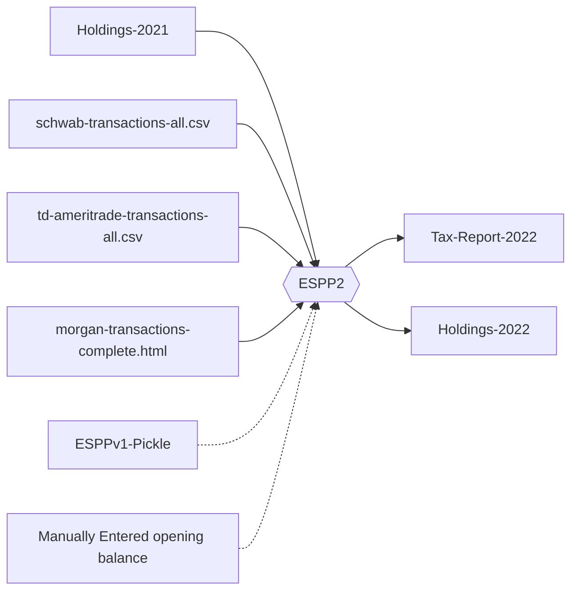

# ESPP 2

[](https://github.com/otroan/ESPP2/actions/workflows/main.yml)

## Introduction
The ESPP2 tool serves both as a backend for a web frontend and a command line tool. The tool is built to help calculate Norwegian taxes on ESPP (Employee Stock Purchase Plan) and RSU (Restricted Stock Unit) shares. It also supports other shares held from TD Ameritrade.

To calculate taxes, the tool needs to know the whole "history" of the stock position. The purchase price and date when it was acquired, as well as any dividends and tax-free deductions accumulated. Unfortunately, some stock brokers do not provide the complete transaction history. This problem is also compounded by the fact that while Norwegian tax law requires selling FIFO, some brokers allow the user to sell any lot, or makes it hard to sell FIFO.

The tool tries to alleviate this problem by taking a complete set of holdings by a year end as input and likewise generating a new holdings file for the tax year. For next year, that means one only need to provide the current year transactions and the holdings file from the previous year.

The tax processing pipeline looks something like this:



In case you are transitioning from the old tool or having not used a tool at all, see the section "if you have no holdings file" below.

### Data formats
The tool uses JSON as the data format for all input and output. The JSON schema for the different data formats are defined in the `espp2/data` directory.

There are data importers for the following formats:
- Schwab CSV
- TD Ameritrade CSV
- Morgan Stanley HTML
- ESPPv1 pickle file

### Fair Market Value
The FMV module downloads and caches historical fair market values for shares and exchange rates.
It has a manually maintained list of Oracle P&L 6 month sliding window rates used for ESPP that we each year receive from the stocks team.

The USD to NOK exchange rate is downloaded from the Norwegian Central Bank.
The stock prices are downloaded from Alpha Vantage.
Dividend dates and fundamentals are fetched from the EOD Historical Data provider.

### Tax calculation
The espp2 tool takes a normalized transaction history for the current year, a holdings file listing all held positions at the end of the previous year, and a list of "wires" received all in JSON format. Then it calculates the gains/losses and outputs that in a tax-report file and a holdings file for the current year.


## Installation

```
python3 -m venv venv
source venv/bin/activate
pip install git+https://github.com/otroan/ESPP2.git#egg=espp2
```

## How to run

```
espp2 <schwab-2022.csv> <espp1.pickle> --wires <schwab-wires-2022.json>
      --outholdings <schwab-holdings-2022.json>
```

```
espp2 --help
```

Will show the available options. The --verbose option will show the tax calculations in more detail and it is important to verify that these are correct.

*In partiulcar it is important to verify that the total stock positions match the statements from the stock broker. If these numbers do not match, the resulting tax calculation will be wrong.*

## What to do if you don't have a holdings file?

There is a transition required from the old tool to the new tool.

#### Schwab: You have a pickle file from the old tool and as much transaction history as is available
Just give both the pickle file and the Schwab transaction file to the tool.

#### Schwab: You have a complete transaction history from all years
Which means you have only worked for the company for less than three years. Just pass the complete transaction file to the tool and you are good to go.

#### Schwab: You have an incomplete transaction history

You will need to create a holdings file giving the opening balance for the last year. Schwab gives only 3 years of transaction history, so you will need to manually create the holdings file for the year overlapping with that. Which for the tax year of 2022 means that you must provide the opening balance as of 2019-12-31.

The holdings file is a JSON file with the following format:

```
{
    "stocks": [
        {
            "symbol": "CSCO",
            "date": "2019-12-31",
            "qty": 1000.0,
            "purchase_price": {
                "value": NaN,
            }
        }
    ],
    "cash": [],
    "year": 2019,
    "broker": "schwab"
}
```

If all the positions held in 2019 was sold in prior tax years, the tool do not need the purchasing price. If that is not the case, that you hold or have sold positions that are held in 2019 or earlier, you need to provide the purchase date and purchase price for all the held positions.

## Web frontend

The web frontend is a separate project and can be found at https://github.com/MittBrukernavn/ESPP2-web.

The web interface lets the user drag and drop transaction files and presents the tax report in a nice table. It also lets the user download the holdings file, that will be used for running the tool next year.

It also allows the user to input the actual NOK values for received wires and to provide an opening balance.

The web interface uses the same backend as the command line tool, so the same data formats are used.
It is a single request / response REST API between the frontend and the backend. No data is stored on the server, and if the user makes a change to the input, the whole tax calculation is redone.

While the server does some logging, the transaction files are not stored on the server.


## Release notes

### Pickle import

- Trade fees and commissions are not included in the pickle file, so some manual adjustment of the cash balance for Schwab is expected. Typically these are a between a few cents and $19.95.

- Dividends. The pickle file does not include the dividend total, only dividend per share. So the total (for the cash balance) must be calculated based on the calculated number of shares on the ex-date. It seems to be getting it right, but there is some risk of error here.