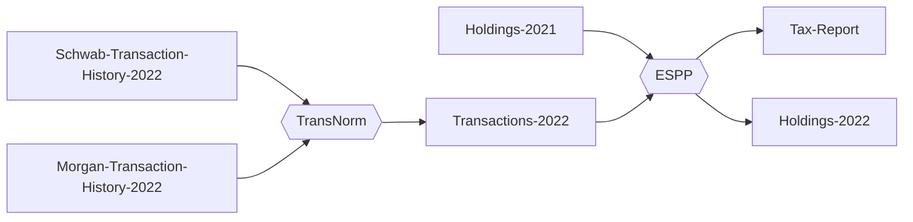
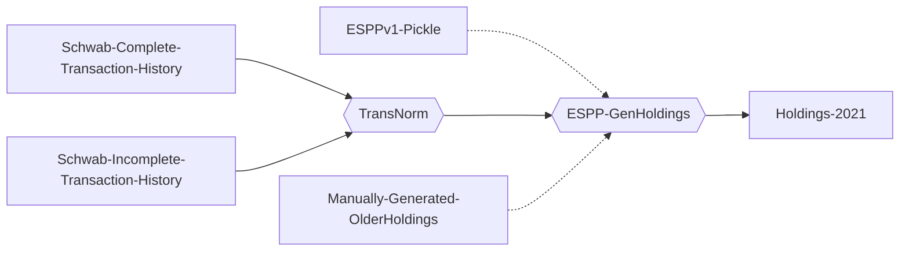

# ESPP 2

## Introduction
The ESPP2 tool is a command line tool built to help calculate Norwegian taxes on ESPP (Employee Stock Purchase Plan) and RSU (Restricted Stock Unit) shares.

The tool is built as a pipeline of small utilities.



In case you are transitioning from the old tool or having not used a tool at all, see the section "if you have no holdings file" below. The pipeline for that looks like:



### Transaction History Normalizer
A transaction history normaliser that uses per-broker plugins to normalize a transaction history into a JSON format, following the expected ESPP2 transaction history data model.
Currently the Schwab CSV format is supported. In addition TD Ameritrade CSV is supported for regular stock transactions. A manual JSON format and a Morgan Stanley HTML table scraper is underway.

### Fair Market Value
The FMV module downloads and caches historical fair market values for shares and exchange rates.
It has a manually maintained list of Oracle P&L 6 month sliding window rates used for ESPP.

### Tax calculation
The main espp2 tool takes a normalized transaction history for the current year, a holdings file listing all held positions at the end of the previous year, and a list of "wires" received all in JSON format. Then it calculates the gains/losses and outputs that in a tax-report file and a holdings file for the current year.


## Installation

```
python3 -m venv venv
source venv/bin/activate
pip install git+https://github.com/otroan/ESPP2.git#egg=espp2
```

## How to run

```
espp2_transnorm --transaction-file <schwab-2022.csv> --format schwab --output-file <schwab-transactions-2022.json>

espp2 --year=2022 --transaction-file <schwab-transactions-2022.json> --inholdings-file=<schwab-holdings-2021.json> --output-file <schwab-tax-report-2022.json --outholdings-file <schwab-holdings-2022.json> --log=debug --wire-file=<schwab-wires-2022.json>

```

## What to do if you don't have a holdings file?
As the tax generation tool requires the previous years positions. That may have to be calculated as it's different from the previous version of this tool. There are 3 ways to generate the previous year holding file:

Note: It is very important that you verify the total stock positions with the statements from the stock broker. If these numbers do not match, the resulting tax calculation will be wrong.

### Exporting it from the pickle file from last years tax run (previous version) (not yet implemented)

### Generated from the complete transaction history from all years

### Manually created holdings file and as much transaction history as is available.

Normalize the complete transaction history (combined with manual holdings file):

```
espp2_transnorm --transaction-file <schwab-complete-history.csb> --output-file <schwab-complete-transactions.json>

espp2_genholdings --year 2021 --transaction-file <schwab-complete-transactions.json> [--inholdings-file <schwab-holdings-2018.json>] --outholdings-file <schwab-holdings-2021.json>

```

## TODO
- [ ] ESPPv1 pickle holdings export
- [x] Holdings export from complete transaction history
- [ ] Manual JSON transaction history importer
- [ ] TD Ameritrade CSV transaction history importer
- [ ] JSON schema and validation for transaction, holdings, and wire formats
- [ ] Windows, OSX packaging through Github actions
- [ ] Unit tests
- [ ] User interface. Local webserver? At least pretty printing reporting tool


