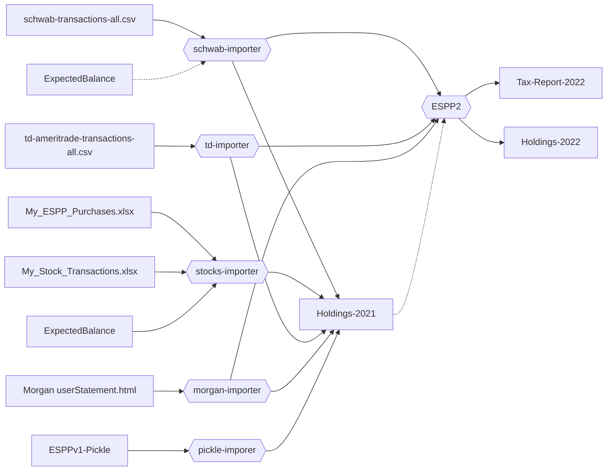

# ESPP 2

[](https://github.com/otroan/ESPP2/actions/workflows/main.yml)

## Introduction
The ESPP2 tool serves both as a backend for a web frontend and a command line tool. The tool is built to help calculate Norwegian taxes on ESPP (Employee Stock Purchase Plan) and RSU (Restricted Stock Unit) shares. It also supports other shares held from TD Ameritrade.

To calculate taxes, the tool needs to know the whole "history" of the stock position. The purchase price and date when it was acquired, as well as any dividends and tax-free deductions accumulated. Unfortunately, some stock brokers do not provide the complete transaction history. This problem is also compounded by the fact that while Norwegian tax law requires selling FIFO, some brokers allow the user to sell an arbitrary lot, or makes it hard to sell FIFO.

The tool tries to alleviate this problem by taking a complete set of holdings by a year end as input and likewise generating a new holdings file for the tax year. For next year, that means one only need to provide the current year transactions and the holdings file from the previous year.

The tax processing pipeline looks something like this:



In case you are transitioning from the old tool or having not used a tool at all, see the section "if you have no holdings file" below.

### Data formats
The tool uses JSON as the data format for all input and output. The JSON schema for the different data formats are defined in the `espp2/data` directory.

There are data importers for the following formats:
- Schwab CSV
- TD Ameritrade CSV
- Morgan Stanley HTML
- ESPPv1 pickle file
- My_ESPP_Purchases XLS
- My_Stock_Transactions XLS

### Fair Market Value
The FMV module downloads and caches historical fair market values for shares and exchange rates.
It has a manually maintained list of Oracle P&L 6 month sliding window rates used for ESPP that we each year receive from the stocks team.

The USD to NOK exchange rate is downloaded from the Norwegian Central Bank.
The stock prices are downloaded from Alpha Vantage.
Dividend dates and fundamentals are fetched from the EOD Historical Data provider.

**Note:** We only have ESPP exchange rate data back to 2013. If you sell ESPP shares that are purchased prior to 2013, you will need to manually enter the exchange rate for those shares.

### Tax calculation
The espp2 tool takes a normalized transaction history for the current year, a holdings file listing all held positions at the end of the previous year, and a list of "wires" received all in JSON format. Then it calculates the gains/losses and outputs that in a tax-report file and a holdings file for the current year.

## Installation

Requires Python3.11

```
python3 -m venv venv
source venv/bin/activate
pip install git+https://github.com/otroan/ESPP2.git#egg=espp2
```

## How to run

The tool runs in multiple phases to collect all the required data. The various use cases are described below. Most support is for Schwab users, Morgan Stanley is experimental.

The transaction history for Schwab can be downloaded from https://eac.schwab.com:  Go to _History_, choose _Equity Award Center_ from the blue drop down box, date range _All_, click _Search_. Then there is the export link in the upper right corner of the page.

This transaction history only covers transactions from the last 4 years. The further process depends on if this file covers all your transactions or if you have a pickle file from running the legacy espp tool last year. 

### Option 1: Schwab - Transaction history is complete

If you have a complete transaction history from Schwab, you can just run the tool with the transaction file as input.
If you have made transfers to a Norwegian bank account, run the tool with the --outwires option to generate a template file for the wires.

```
espp2 <schwab-all-transactions.csv> --outwires wires-2022.json
```

Now edit ```wires-2022.json``` and fill in the actual amount you have received in your bank acount in NOK where you see 'NaN'. Save the changes and re-run with the wire file to generate the tax report and a new holdings file that you should store in a save place for next year.

```
espp2 <schwab-all-transactions.csv> --wires wires-2022.json --outholdings holdings-2022.json
```

### Option 2: Schwab - Incomplete transaction history and Pickle file from the old tool

Combine the transaction history from the pickle file with the CSV file, to generate a holdings file for the previous year:

```
espp2 <schwab.csv> <espp1.pickle> --outholdings holdings-2021.json
```

Re-run to with the holdings file to generate a wire template.

```
espp2 <schwab.csv> --inholdings holdings-2021.json --outwires wires-2022.json
```

Now edit ```wires-2022.json``` and fill in the actual amount you have received in your bank acount in NOK where you see 'NaN'. Save the changes and re-run a last time with the holdings and wire file to generate the tax report and a new holdings file that you should store in a save place for next year.

```
espp2 <schwab.csv> --inholdings holdings-2021.json --wires wires-2022.json  --outholdings holdings-2022.json
```

### Option 3: Schwab - Incomplete transaction history and not holding shares acquired prior to the transaction history in current tax year

If all the shares held prior to the transaction history (4 years), have been sold prior to the tax year, then the tool does not need to deal with those stocks.

Given an expected balance for the end of the previous tax year (2021-12-31 in this case), the tool walks the ledger backwards and inserts an artifical buy record at the beginning.

```
espp2 <schwab-all-transactions.csv> --expected-balance '{"symbol": "CSCO", "qty": 936.5268 }' --outholdings holdings-2021.json
espp2 <schwab-all-transactions.csv> --inholdings holdings-2021.json --outholdings holdings-2022.json
```

### Option 4: Schwab - Incomplete transaction history and no pickle file

This applies to a user who has so far done their foreign shares taxes manually.
We can calculate the balance for the previous year by using the My_ESPP_Purchases.xls file and the My_Stock_Transactions.xls file from the stocks website. Combined with a manual record of the numbers of shares held at the end of the previous year.

**NOTE:** This will not work if one has reinvested dividends in shares.

```
To generate the holdings file:
espp2 My_ESPP_Purchases.xlsx My_Stock_Transactions.xlsx --outholdings holdings-2021.json --expected-balance "CSCO: 936.527"

To generate taxes:
espp2 <schwab-2022.csv> --wires wires-2022.json --holdings holdings-2021.json> --outholdings holdings-2022.json
```

### Option 5: Schwab - None of the above works
If none of the above works, then your best may be to run option 3 above, that generates a holdings file for 2021, and gives an artifical buy entry with purchase price 0 for the missing shares. You then need to go back and try to find the purchase prices for the stock buys that make up this lot. That information may be available in Schwab statements.

Another alternative is to try to manually create a Schwab CSV with all historical trades. Again from Schwab statements.

### Morgan Stanley - Complete transaction history

Note: Morgan support is still under construction. Proceed with caution!

Morgan Stanley provides a complete transaction history for all years. The tool can be run with the Morgan Stanley transaction file as input.

```
espp2 <morgan-2022.html> --outholdings <morgan-holdings-2022.json>
```

```
espp2 --help
```
Will show the available options. The --verbose option will show the tax calculations in more detail and it is important to verify that these are correct.

*In particular it is important to verify that the total stock positions match the statements from the stock broker. If these numbers do not match, the resulting tax calculation will be wrong.*


## Release notes

- We only have ESPP exchange rates back to 2013. If you sell ESPP shares that are purchased prior to 2013, you will need to manually enter the exchange rate for those shares.
- ESPP shares purchased on the last day of the year, although they are received in the trading account in the next year, use the purchase date.
- The tax-free deduction was introduced in 2006. If you hold shares purchased prior to 2006, you will need to manually enter the purchase price for those shares.
- ESPP shares purchases on the last day of the year receives the tax free deduction and counts against wealth tax. Even though they are not in the broker account yet.
- For exchange rate gains/losses within the same year as the stock sale, those can be added to the stock gains/losses.
